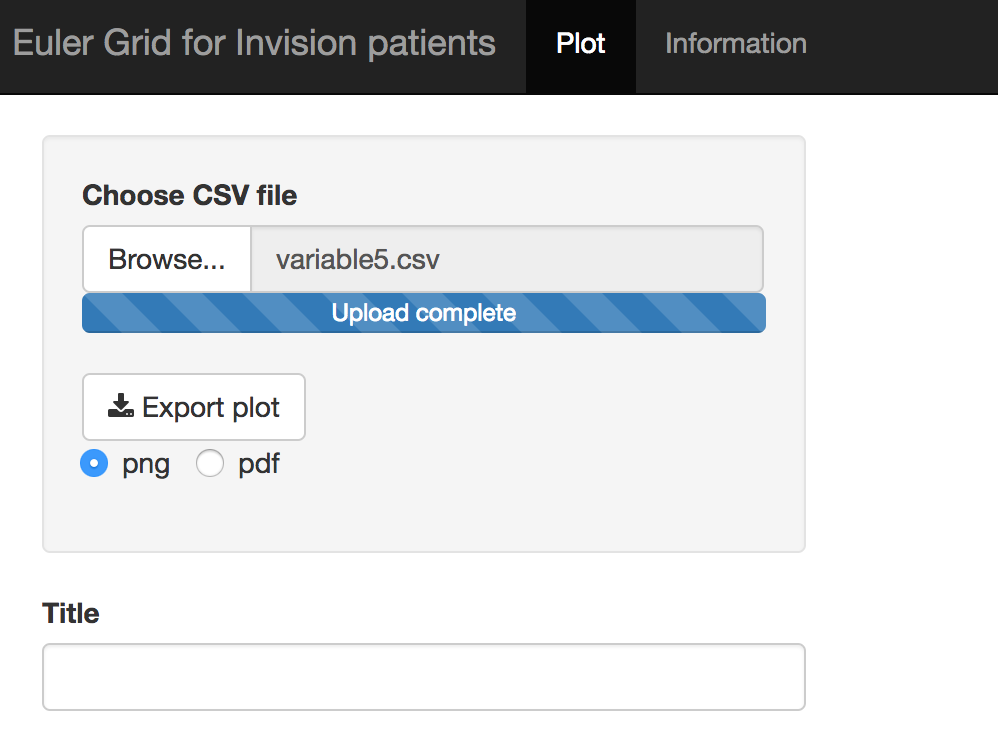

# Euler Grid for Invision patients


This shiny app  generates Euler Grid for more than three variables. Euler Grid will help easy visualization of overlap among differnt sets.

### How to use the app:
This app is hosted in the shinyapps.io web server. This app can be accessed through any web browser using the link <https://tanzir.shinyapps.io/eulergrid/>. It is not necessary to have R or R studio installed in the system.

As an input the app takes csv file. In the plot page of the user interface there is a browse button which can be used to choose the csv file from the local disk.


When the csv file is selected, the app will show the preview of the file and will make Euler Grid from the input file.

User can input tilte for the plot dynamically using the "Title" text box.

The plot can be saved as either png or in pdf format using the "Export plot" button and using the radio button to choose the output file type.

Information about the app and standard query format to create the csv file can be found in the information page of the app.





To get proper labeling of the plot following SQL query format is recommended.

```
SELECT ACT.Admit_SNF, ACT.Admit_Acute, ACT.Outpt_Diagnostic, 
       ACT.Outpt_ZSFG_Urgent_Care,ACT.Outpt_COPC, ACT.ED ,
       COUNT(DISTINCT ActiveMRN) AS N_Pts 
       FROM 
       ( SELECT DISTINCT ENC.FYActivity, ENC.ActiveMRN,
       ISNULL(ADM.Admit_SNF,'N') AS Admit_SNF, 
       ISNULL(ED.ED, 'N') AS ED, ISNULL(OPT.Outpt_Diagnostic, 'N') AS Outpt_Diagnostic, 
       ISNULL(ADMA.Admit_Acute,'N') AS Admit_Acute,
       ISNULL(OPTU.Outpt_ZSFG_Urgent_Care, 'N') AS Outpt_ZSFG_Urgent_Care,
       ISNULL(OPTC.Outpt_COPC, 'N') AS Outpt_COPC
       FROM ( SELECT * FROM [Invision].[sfhn].[tblEncounter] 
       WHERE FYActivity = 'FY1516' ) ENC 
       LEFT JOIN ( SELECT ActiveMRN, 'Y' AS Admit_SNF 
       FROM [Invision].[sfhn].[tblEncounter] WHERE FYActivity = 'FY1516' AND EncounterType = 'Admit'
       AND PtType in ('G','M','S') ) ADM ON ADM.ActiveMRN = ENC.ActiveMRN 
       LEFT JOIN ( SELECT ActiveMRN, 'Y' AS ED 
       FROM [Invision].[sfhn].[tblEncounter] WHERE FYActivity = 'FY1516' AND EncounterType='ED' ) ED 
       ON ED.ActiveMRN = ENC.ActiveMRN LEFT JOIN ( SELECT ActiveMRN, 'Y' AS Outpt_Diagnostic 
       FROM [Invision].[sfhn].[tblEncounter] WHERE FYActivity = 'FY1516' AND EncounterType='Outpatient' 
       AND HospSvc in ('Rad', 'Lab') ) OPT ON OPT.ActiveMRN = ENC.ActiveMRN 
       LEFT JOIN ( SELECT ActiveMRN, 'Y' AS Admit_Acute FROM [Invision].[sfhn].[tblEncounter] 
       WHERE FYActivity = 'FY1516' AND EncounterType = 'Admit' 
       AND PtType not in ('G','M','S') ) ADMA ON ADMA.ActiveMRN = ENC.ActiveMRN 
       LEFT JOIN ( SELECT ActiveMRN, 'Y' AS Outpt_ZSFG_Urgent_Care 
       FROM [Invision].[sfhn].[tblEncounter] WHERE FYActivity = 'FY1516' 
       AND EncounterType='Outpatient' AND Clinic in ('URGCARE') ) OPTU 
       ON OPTU.ActiveMRN = ENC.ActiveMRN LEFT JOIN ( SELECT ActiveMRN, 'Y' AS Outpt_COPC 
       FROM [Invision].[sfhn].[tblEncounter] WHERE FYActivity = 'FY1516' 
       AND EncounterType='Outpatient' 
       AND PtType in ('Y') ) OPTC ON OPTC.ActiveMRN = ENC.ActiveMRN 
       WHERE ENC.FYActivity = 'FY1516' ) ACT 
       GROUP BY ACT.Admit_SNF, ACT.Admit_Acute, ACT.Outpt_Diagnostic, 
       ACT.Outpt_ZSFG_Urgent_Care,ACT.Outpt_COPC, ACT.ED
```
